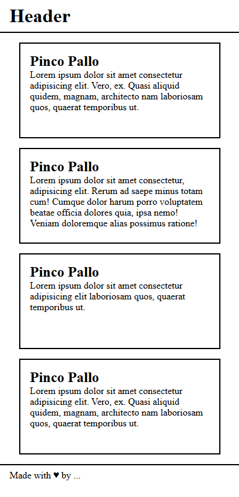

# HTML/CSS Wireframe

HTML and CSS exercise to recreate a mobile wireframe layout.

## Goal

Reproduce the wireframe shown at the end of this document, focusing mainly on:

- box model
- spacing
- consistent layout
- coherent card dimensions

## Requirements

- Set `body { width: 512px; }` to simulate a smartphone screen
- Use the browser inspector to test spacing before updating the code
- Focus on harmonious spacing rather than exact pixel-perfect values
- Keep card heights visually consistent when they contain less text
- Allow cards to grow in height when they contain more text

## Wireframe

&nbsp;

---

&nbsp;

[**Go To Top &nbsp; ⬆️**](#htmlcss-wireframe)
